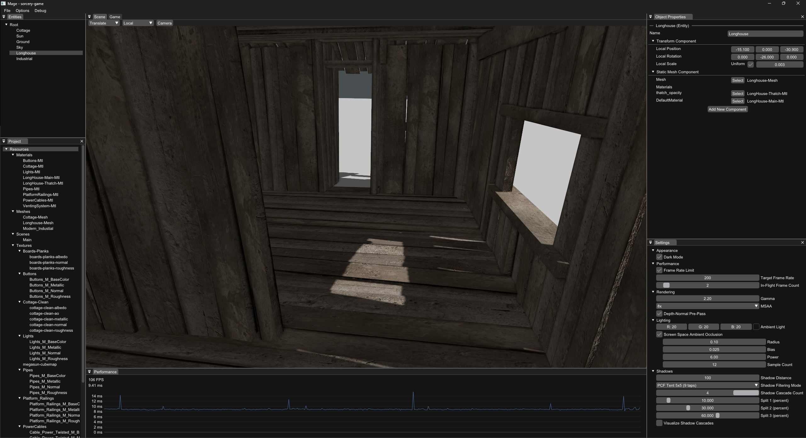
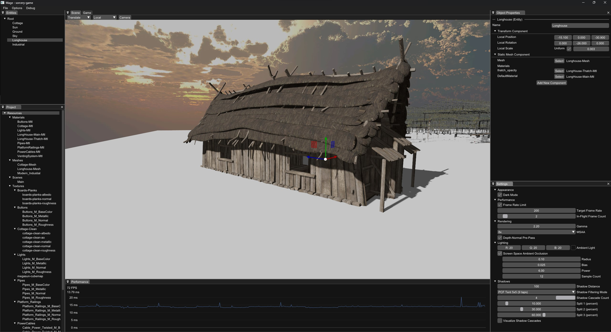
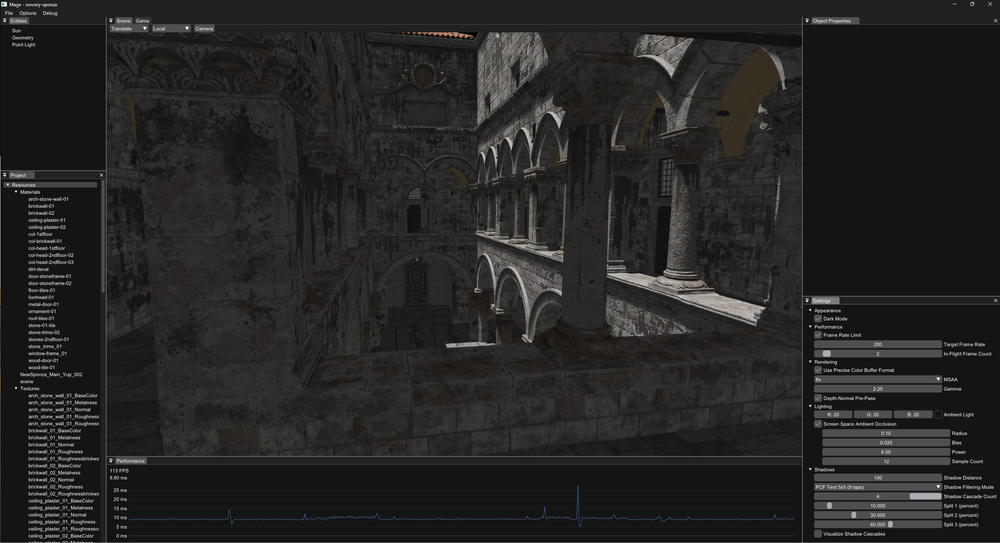
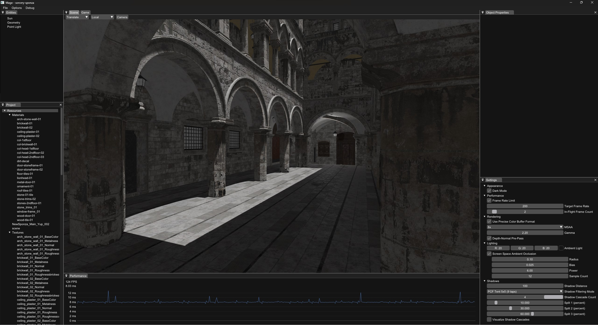
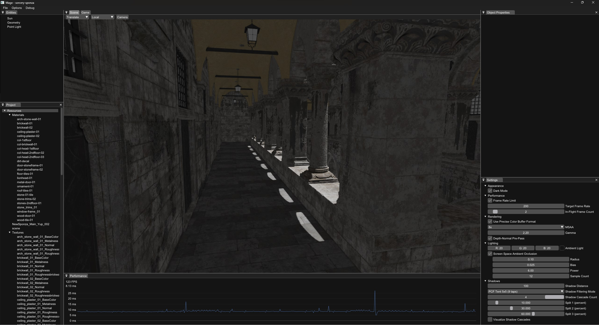
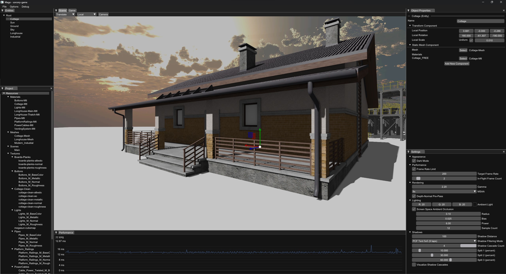
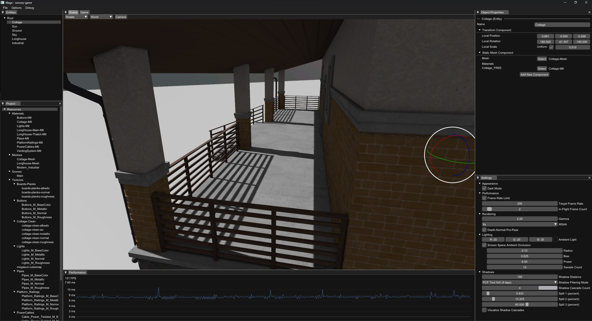
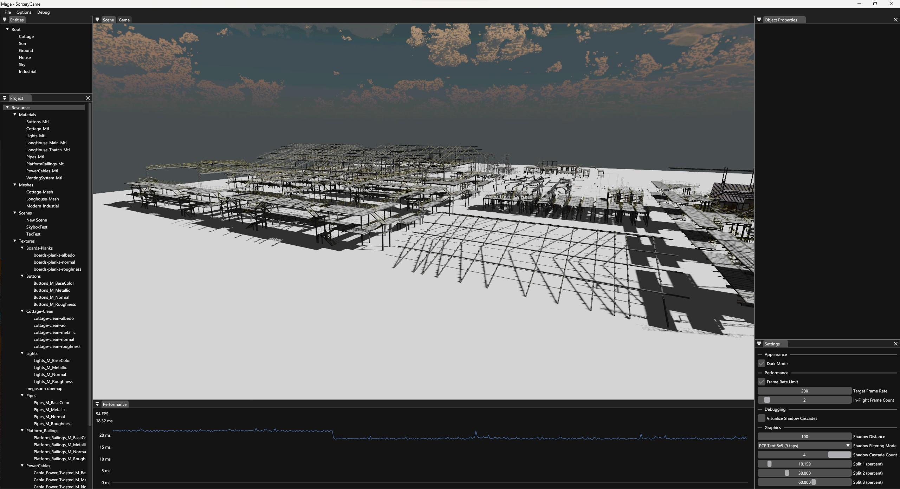

# 🪄 Sorcery 🪄

Sorcery is my homemade game engine that I started developing during my second BSc year as a way to learn about the technologies behind video games. I have used it as my BSc thesis and planning to use it as my MSc thesis too. Generally it lacks quite a few features, mainly because I can work on it only in my free time and I also keep reworking systems forever and ever as I learn new things. Basically I use it to implement, integrate, and play with ideas I come across as well my own.

## Gallery 
Some screenshots from Sorcery's editor, Mage!

|  |  |
|--|--|
|  |  |
|  |  |
|  |  |
|  |  |
|  |

## Features
### Implemented
* DX12 Renderer
  * Built using Shader Model 6.6, Resource Binding Tier 3, HLSL Dynamic Resources, Enhanced Barriers, and other modern features
  * Hybrid Forward rendering
    * Forward rendering with a thin G-buffers for screen space effects
  * PBR material system using Cook-Torrance BRDF
    * Albedo, metallic, roughness, ao, and normal values/maps, alpha clipping support
  * Directional, spot, and pointlights
  * Cascaded Shadow Maps for directional lights
    * Customizable split distances
    * Stabilized projection
  * Dynamic spot and pointlight shadow resolution
    * Screen-coverage based allocation from shadow atlas
  * PCF Tent filtering on shadow maps
  * Depth and normal shadow bias
  * MSAA
  * HDR Skybox
  * Mipmapping
  * Frustum culling for cameras and shadows
  * Screen Space Ambient Occlusion (SSAO)
  * Multi-camera support with custom viewports and render targets
* Entity-Component model
  * Camera, Static Mesh, Light, Skybox, and Transform components
  * Transform hierarchy
  * Support for custom components (scripting API)
  * Support for tickable components (behaviors)
  * Scene system
* Resource Management
  * Custom binary formats for textures, scenes, materials, and meshes
  * On-demand resource loading when switching scenes
* Custom linear algebra library
  * Using x64 intrinsics for better performance
* Editor
  * Full-fledged world editor
    * Transform manipulation
    * Scene traversal
    * Entity-component editing
  * Asset importing, preconditioning, and management
  * Asset creation and editing (materials, scenes)
  * Performance logging
  * Several changable settings (graphics, performance, etc.)

### Planned
* Graphics and rendering
  * Better support for transparency effects
  * Percentage-Closer Soft Shadows (PCSS)
  * Image-Based Lighting (IBL)
  * Hybrid Tiled (Forward+) rendering
  * Support for writing custom shaders for materials
  * Ground Truth-based Ambient Occlusion (GTAO)
  * Screen Space Shadows
  * Screen Space Reflections (SSR)
  * Screen Space Subsurface Scattering
  * Screen Space Global Illumination (SSGI)
  * Vulkan backend
* Nvidia PhysX integration for physics
* Support for custom script compilation
* Audio playback
* Possibly more things

## Used technologies and third-party libraries
Non-exhaustive list of core components:
- Win32 for window and event handling
- Direct3D 12 for rendering
- RTTR for runtime reflection
- Dear ImGui for tool interfaces
- Assimp for model asset importing
- DirectXTex for texture preprocessing

## Building and Usage
### Build requirements
- Windows SDK 10.0.22000 or newer
- MSBuild
- MSVC v143 toolset
### Runtime requirements
- Windows 11
- Feature level 11_0 capable GPU
- AVX2 capable CPU
### Building
- Run **setup.bat** from the root directory
- Build the solution in the root directory
### Usage
Just open Mage and poke around in it!
